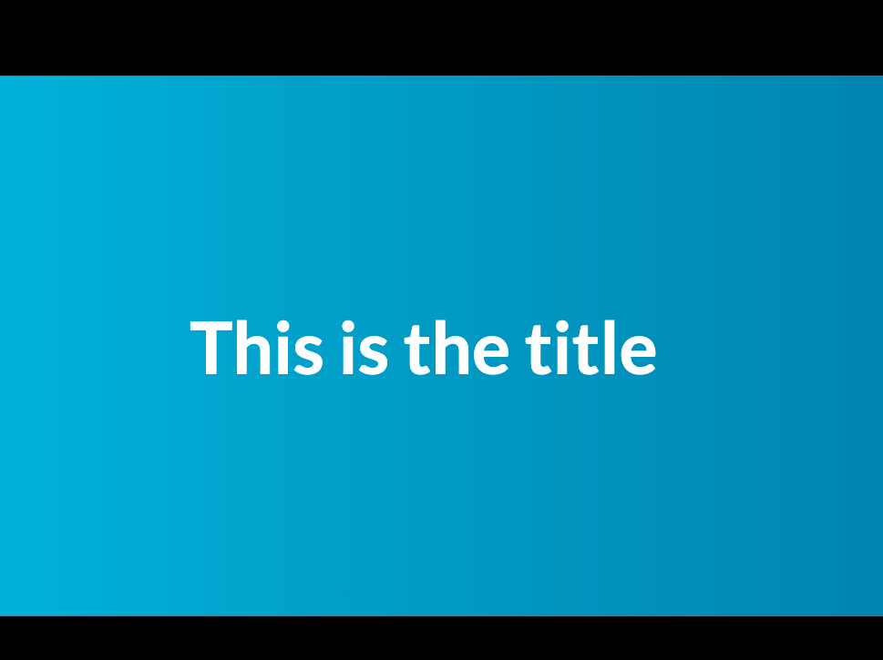
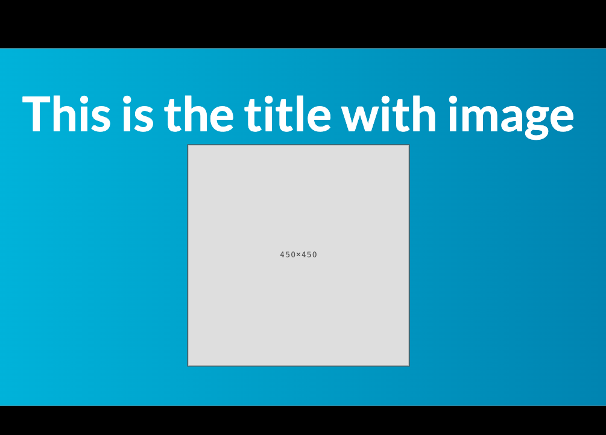
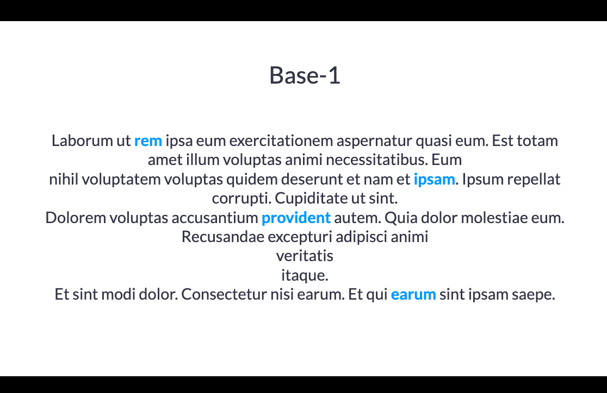
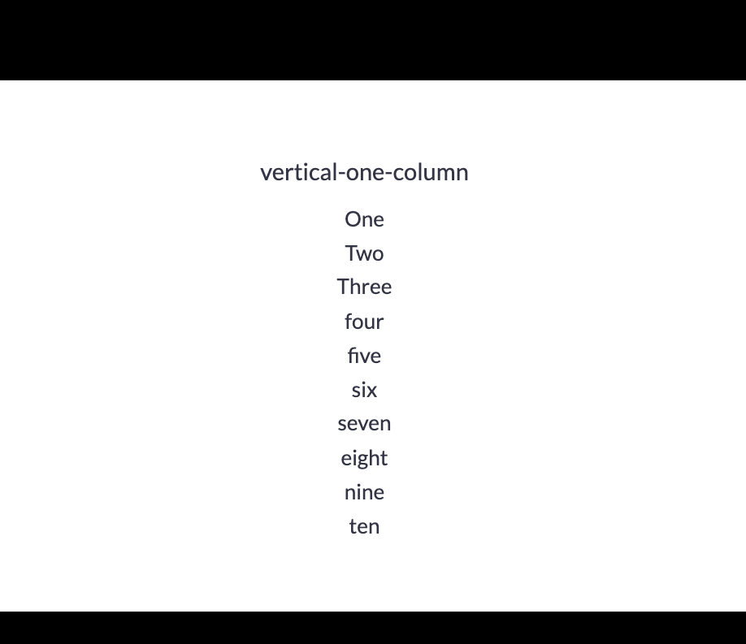
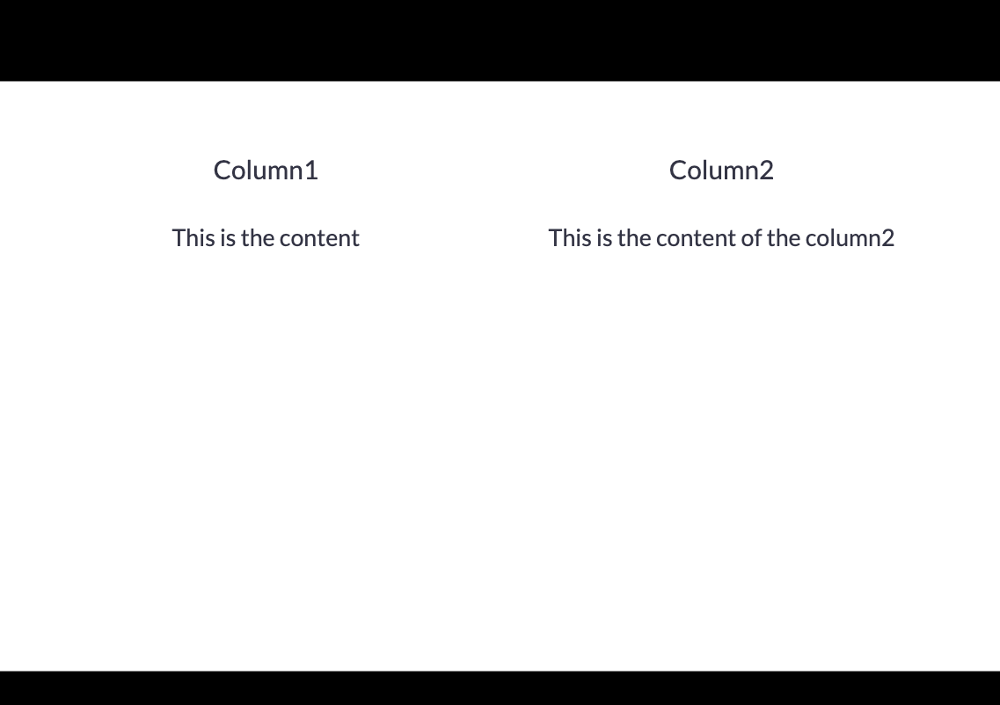
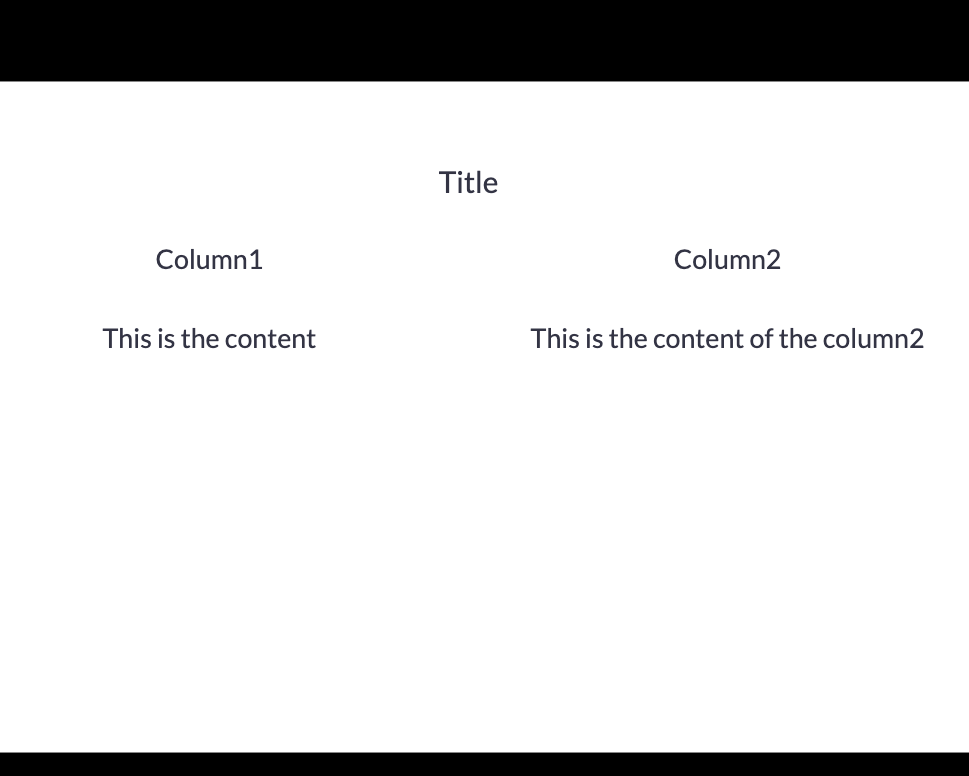
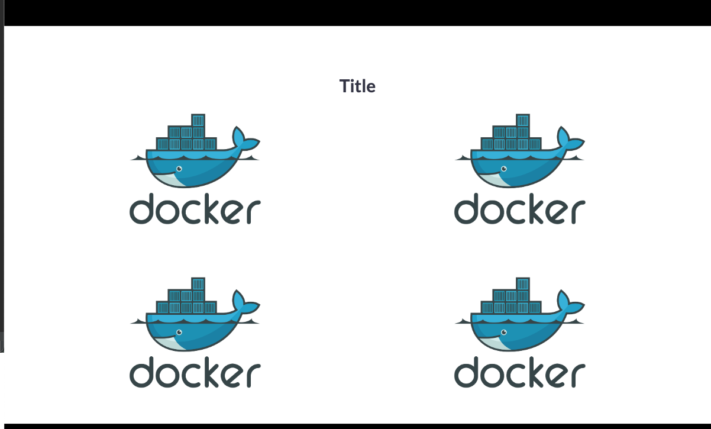

# Base slides

## Backgrounds

```md
<!-- _layout: bg-default -->
```

### bg-default


### bg-blue


### bg-gray


### bg-green


### bg-violet


## Layouts

### Intro

```md
<!-- _layout: intro -->  
<!-- _footer:  -->  


# Intro

This is a content
```


### Title-1

```md
<!-- _layout: title-1 -->

# This is the title with image


```



#### With image

Note: max height: 450

```md
<!-- _layout: title-1 -->

# This is the title with image


```



### Base-1

```md
<!-- _layout: base-1 -->  

# Base-1

Laborum ut **content**
```



#### With image variant

```md
<!-- _layout: base-1 -->  

# Base-1 with image


```


### Fullimage

```md

```


### two-columns-image-content

```md
<!-- _layout: two-columns-image-content -->

::: group content

Content

Content 2

Content 3

:::


```

#### variant-right

```md
<!-- _layout: two-columns-image-content variant-right -->

::: group content

Content

Variant right

Content 3

:::


```

### Vertical-one-column

```md

<!-- _layout: vertical-one-column -->  

# vertical-one-column

- One
- Two
- Three
- four
- five
- six
- seven
- eight
- nine
- ten

```



#### With image + content

```md

<!-- _layout: vertical-one-column -->  

## Base-1 with image and content

This is the content


```


### Vertical-two-columns

```md
<!-- _layout: vertical-one-column -->  

# Column1

This is the content

# Column 2

This is the content of column2

```



### Vertical-two-columns-with-title

```md
<!-- _layout: vertical-two-columns-with-title -->

# Title

## Column1

This is the content

## Column2

This is the content of the column2

```



### Wrap

```md
<!-- _layout: grid -->

# Title


```


