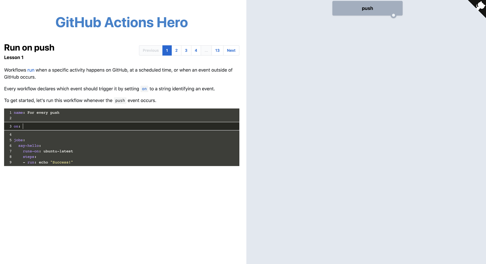

<style scoped>
  .area-5 {
    text-align: center;
  }
</style>

<!-- _class: theme-intro -->


<div class="area-5 flex-vertical justify-center align-center">
  <p class="paragraph-1 c-secondary">GitHub Actions</p>
</div>

<div class="area-8 flex-vertical align-bottom">
  
</div>

---

<!-- backgroundColor: #FFFFFF -->
<footer class="wave-1">
  <svg xmlns="http://www.w3.org/2000/svg" viewBox="0 0 1440 320">
    <path fill="#F3F4F5" fill-opacity="1" d="M0,224L18.5,218.7C36.9,213,74,203,111,176C147.7,149,185,107,222,112C258.5,117,295,171,332,176C369.2,181,406,139,443,144C480,149,517,203,554,218.7C590.8,235,628,213,665,197.3C701.5,181,738,171,775,160C812.3,149,849,139,886,165.3C923.1,192,960,256,997,272C1033.8,288,1071,256,1108,240C1144.6,224,1182,224,1218,229.3C1255.4,235,1292,245,1329,234.7C1366.2,224,1403,192,1422,176L1440,160L1440,320L1421.5,320C1403.1,320,1366,320,1329,320C1292.3,320,1255,320,1218,320C1181.5,320,1145,320,1108,320C1070.8,320,1034,320,997,320C960,320,923,320,886,320C849.2,320,812,320,775,320C738.5,320,702,320,665,320C627.7,320,591,320,554,320C516.9,320,480,320,443,320C406.2,320,369,320,332,320C295.4,320,258,320,222,320C184.6,320,148,320,111,320C73.8,320,37,320,18,320L0,320Z"></path>
  </svg>
</footer>

<div class="flex-vertical text-center">
  <p class="paragraph-2 c-tertiary">Automatiza, customiza, y ejecuta tu workflow en GitHub</p>
</div>
<div class="flex-horizontal justify-center padding-2x z-index-10">
  
</div>

---

<!-- backgroundColor: #4E59F6  -->

<div class="animation1">

!!!include(animations/action_flow.svg)!!!

</div>

---

<!-- backgroundColor: #FFFFFF  -->
<!-- _class: nine-areas align-center  -->

<div class="area-1-3 text-center">
  <p class="paragraph-2 area-1-3 c-blue">Alternativas</p>
</div>
<div class="area-4 text-center" data-marpit-fragment>
  
</div>
<div class="area-5 text-center" data-marpit-fragment>
  
</div>
<div class="area-6 text-center" data-marpit-fragment>
  
</div>
<div class="area-7 text-center" data-marpit-fragment>
  
</div>
<div class="area-9 text-center" data-marpit-fragment>
  
</div>

--- 


---


---

<!-- _backgroundColor: #EDEDED -->
<!-- _class: nine-areas align-center  -->

<div class="area-4-6 flex-vertical justify-center align-center">
  <p class="paragraph-1 c-blue">¿Dónde encontrarlo?</p>
</div>
<div class="area-3 text-center z-index-10">
  
</div>

---

<!-- _backgroundColor: #22272E -->

<div class="area-4-6 flex-vertical justify-center align-center">
  <p class="paragraph-2 c-blue">Integrado en tu repo</p>
</div>


---

<!-- _backgroundColor: #22272E -->

<div class="area-4-6 flex-vertical justify-center align-center">
  <p class="paragraph-2 c-blue">Integrado en cada commit</p>
</div>


---

<!-- _backgroundColor: #22272E -->

<div class="area-4-6 flex-vertical justify-center align-center">
  <p class="paragraph-2 c-blue">Feedback automático</p>
</div>


---

<!-- _backgroundColor: #22272E -->

<div class="area-4-6 flex-vertical justify-center align-center">
  <p class="paragraph-2 c-blue">Información y logs detallados</p>
</div>


---

<!-- _class: theme-intro -->


<div class="area-1-3 flex-vertical justify-center align-center">
  <p class="paragraph-1 c-secondary">Pero antes...</p>
</div>

<div class="area-8 flex-vertical align-bottom">
  
</div>

---

<!-- _backgroundColor: #22272E -->
<!-- _class: nine-areas align-center  -->

<div class="area-4-6 flex-horizontal align-center justify-center">
  
  <p class="paragraph-2 c-secondary">¿Qué es CI/CD?</p>
</div>

---

<!-- _backgroundColor: #22272E -->
<!-- _class: nine-areas align-center  -->

<div class="area-4-6 flex-horizontal align-center justify-center">
  
  <p class="paragraph-2 c-secondary text-center">¿Es lo mismo hacer CI/CD que automatizar?</p>
</div>

---

<!-- _backgroundColor: #22272E -->
<!-- _class: nine-areas align-center  -->

<div class="area-4-6 flex-horizontal align-center justify-center">
  
  <p class="paragraph-2 c-secondary text-center">¿Qué es compatibilidad hacia atrás o backward compatibility?</p>
</div>

---

<!-- _backgroundColor: #22272E -->
<!-- _class: nine-areas align-center  -->

<div class="area-4-6 flex-horizontal align-center justify-center">
  
  <p class="paragraph-2 c-secondary text-center">¿Qué es Semantic Versioning?</p>
</div>

::: slideLink https://semver.org/ external-link-black
:::

---

<!-- _backgroundColor: #22272E -->

<div class="area-4-5 flex-horizontal align-center justify-center">
  
  <div class="h100">
    <p class="paragraph-2 c-secondary text-center">Major</p>
    <p class="paragraph-3 c-secondary text-center">Cambio grande en la API que hace incompatible con versiones anteriores</p>
  </div>
</div>

---

<!-- _backgroundColor: #22272E -->

<div class="area-4-5 flex-horizontal align-center justify-center">
  
  <div class="h100">
    <p class="paragraph-2 c-secondary text-center">Minor</p>
    <p class="paragraph-3 c-secondary text-center">Cambio menor que mantiene compatibilidad hacia atrás</p>
  </div>
</div>

---

<!-- _backgroundColor: #22272E -->

<div class="area-4-5 flex-horizontal align-center justify-center">
  
  <div class="h100">
    <p class="paragraph-2 c-secondary text-center">Patch</p>
    <p class="paragraph-3 c-secondary text-center">Parche, corrección de bugs, fixes menores</p>
  </div>
</div>

---

<!-- _class: theme-intro -->


<div class="area-1-3 flex-vertical justify-center align-center">
  <p class="paragraph-1 c-secondary">Conceptos básicos</p>
</div>

<div class="area-8 flex-vertical align-bottom">
  
</div>

---

<div class="flex-vertical margin-top-5x">
  <p class="paragraph-2 c-tertiary">Action</p>
</div>
<div class="flex-vertical gap-4x justify-center margin-top-2x">
  <p class="c-blue paragraph-3 emphasis">Es el <b>bloque portable</b> más pequeño</p>
  
</div>

---

<div class="flex-vertical margin-top-5x">
  <p class="paragraph-2 c-tertiary">Artifact</p>
</div>
<div class="flex-vertical gap-4x justify-center margin-top-2x">
  <p class="c-blue paragraph-3 emphasis">Es el resultado, ficheros, paquetes, logs <b>generados</b> por los actions</p>
  <div class="big-emoji">📦</div>
</div>

---

<div class="flex-vertical margin-top-5x">
  <p class="paragraph-2 c-tertiary">Workflow</p>
</div>
<div class="flex-vertical gap-4x justify-center margin-top-2x">
  <p class="c-blue paragraph-3 emphasis">Es el <b>conjunto de acciones</b> ordenadas para realizar un propósito</p>
  
</div>

---

<div class="flex-vertical margin-top-5x">
  <p class="paragraph-2 c-tertiary">Event</p>
</div>
<div class="flex-vertical gap-4x justify-center margin-top-2x">
  <p class="c-blue paragraph-3 emphasis">La actividad que <b>dispara</b> la ejecución de un workflow</p>
  
</div>

---

<div class="flex-vertical margin-top-5x">
  <p class="paragraph-2 c-tertiary">Step</p>
</div>
<div class="flex-vertical justify-center margin-top-2x">
  <p class="c-blue paragraph-3">Cada uno de los pasos que se van ejecutando.</p>
  <p class="c-blue paragraph-3">Pueden ser <b>commands</b> o <b>actions</b></p>
  
</div>

---

<div class="flex-vertical margin-top-5x">
  <p class="paragraph-2 c-tertiary">Job</p>
</div>
<div class="flex-vertical justify-center margin-top-2x">
  <p class="c-blue paragraph-3">Un <b>conjunto de steps</b> para ser ejecutados en un momento dado</p>
  
</div>

---

<!-- backgroundColor: #FFFFFF  -->

<div class="animation1">

!!!include(animations/from-event.svg)!!!

</div>

---

<!-- _class: nine-areas align-center  -->

<p class="area-2 c-blue paragraph-2 text-center">Documentación</p>
<div class="justify-center area-5 margin-top">
  
</div>

::: slideLink https://docs.github.com/en/actions external-link-black
:::

---

<!-- _class: theme-intro -->


<div class="area-4">
  
</div>
<div class="area-5-6 flex-vertical justify-center align-start">
  <p class="paragraph-1 c-secondary">Usando Actions</p>
</div>

---

<div class="flex-vertical justify-center">
  <p class="paragraph-2 c-blue">Estructura</p>
  
</div>

---

<!-- class: invert -->
<!-- _backgroundColor: #2A2B2A -->
<div class="flex-vertical h100 justify-start">
<p class="area-2 c-blue paragraph-2 text-center">Estructura del Workflow</p>

<div class="flex-vertical h100 w100">
<div class="h100 w100">

```yml
name: Nombre del workflow
on: # Definición del event
jobs: # Definición de los jobs
```

</div>

<div class="h100 w100">

```yml
name: Hola mundo
on: [ push ]
jobs:
  build:
    name: Saludos
    runs-on: ubuntu-latest
    steps:
      - name: Hola mundo
        uses: actions/hello-world-javascript-action@v1
        with:
          who-to-greet: 'Mona the Octocat'
        id: hello
      - name: Echo con el tiempo transcurrido
        run: echo 'El tiempo transcurrido ha sido ${{ steps.hello.outputs.time }}.'
```

</div>

</div>
</div>

::: slideLink https://docs.github.com/en/actions/reference/workflow-syntax-for-github-actions external-link-black
:::

---

<!-- _backgroundColor: #22272E -->
<!-- _class: nine-areas align-center  -->

<div class="area-4-6 flex-horizontal align-center justify-center">
  
  <p class="paragraph-2 c-secondary emphasis text-center">¿Cómo tengo que definir el <b>"on"</b> para que el workflow se lance después de cada push?</p>
</div>

---

<!-- _backgroundColor: #22272E -->
<!-- _class: invert -->

```yaml
on: [ push ]
on: push
```

<div class="area-4-6 flex-horizontal align-center justify-center">
  
  <p class="paragraph-2 c-secondary emphasis text-center">¿Cómo tengo que definir el <b>"on"</b> para que el workflow se lance después de cada push?</p>
</div>

---

<!-- _backgroundColor: #22272E -->
<!-- _class: nine-areas align-center  -->

<div class="area-4-6 flex-horizontal align-center justify-center">
  
  <p class="paragraph-2 c-secondary emphasis text-center">¿Qué tengo que hacer para que se lance un workflow después de un <b>comentario</b>?</p>
</div>

---

<!-- _backgroundColor: #22272E -->
<!-- _class: invert -->

```yaml
on:
  issue_comment:
    types:
      - created
```

<div class="area-4-6 flex-horizontal align-center justify-center">
  
  <p class="paragraph-2 c-secondary emphasis text-center">¿Cómo tengo que definir el <b>"on"</b> para que el workflow se lance después de cada push?</p>
</div>

```yaml
on:
  issues:
    types:
      - opened
```

---

<!-- _backgroundColor: #22272E -->

<div class="area-4-6 flex-horizontal align-center justify-center">
  
  <p class="paragraph-2 c-secondary emphasis text-center">Tengo un repo popular y me gustaría saber cuándo me hacen un <b>fork</b> ¿cómo tengo que poner el on del workflow?
</p>
</div>

---

<!-- _backgroundColor: #22272E -->

```yaml
on:
  fork
```

<div class="area-4-6 flex-horizontal align-center justify-center">
  
  <p class="paragraph-2 c-secondary emphasis text-center">Tengo un repo popular y me gustaría saber cuándo me hacen un <b>fork</b> ¿cómo tengo que poner el on del workflow?
</p>
</div>

---

<!-- _backgroundColor: #22272E -->

<div class="area-4-6 flex-horizontal align-center justify-center">
  
  <p class="paragraph-2 c-secondary emphasis text-center">En mi empresa usamos la <b>wiki</b> de github en los repos y queremos enviar a <b>slack un mensaje</b> cada vez que alguien haga un cambio en la wiki ¿cómo tengo que poner el on del workflow?
</p>
</div>

---

<!-- _backgroundColor: #22272E -->

```yaml
on:
  gollum
```

<div class="area-4-6 flex-horizontal align-center justify-center">
  
  <p class="paragraph-2 c-secondary emphasis text-center">Tengo un repo popular y me gustaría saber cuándo me hacen un <b>fork</b> ¿cómo tengo que poner el on del workflow?
</p>
</div>

---

<!-- _backgroundColor: #22272E -->
<!-- _class: align-center  -->

<div class="flex-vertical align-center justify-center">
  

::: slideLink https://github-actions-hero.now.sh/ external-link-black
:::
</div>

---

